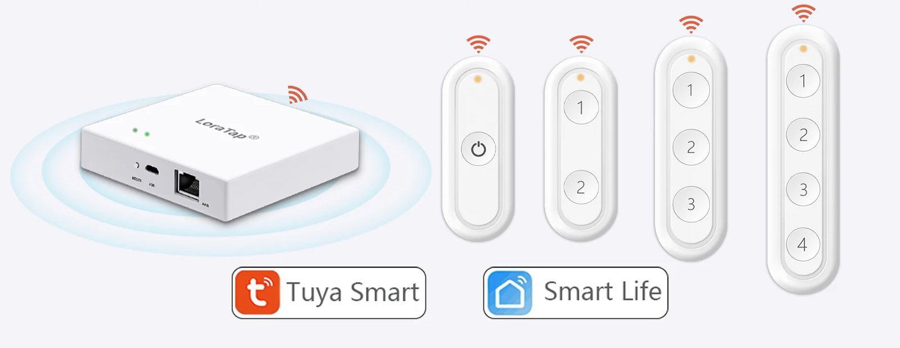

# <a id="Top">LoraTop Wireless switch Zigbee with custom firmware</a>

## TODO

> [!WARNING]
> Пока все сделано только для 4-х кнопочного пульта. Поэтому описание пока будет под него.
>
> **Автор не несет никакой ответственности, если вы, воспользовавшись этим проектом, превратите свой умный пульт (выключатель) в полоумный.**

<!--
| Custom Zigbee Model | Original Zigbee Model | Z2M Model | Original Zigbee Manufacturer| Update method | Photo    |
|:-------------------:|:---------------------:|:---------:|:---------------------------:|:-------------:|:--------:|
| TS0044-z-SlD        | TS0044                | TS0043    | _TZ3000_ee8nrt2l            | OTA file      | :camera: |
| TS0044-z-SlD        | TS0044                | TS0043    | _TZ3000_ee8nrt2l            | OTA file      | :camera: |
-->

| Custom Zigbee Model | Original Zigbee Model | Z2M Model | Original Zigbee Manufacturer| Update method | Photo    |
|:-------------------:|:---------------------:|:---------:|:---------------------------:|:-------------:|:--------:|
| TS0041-z-SlD        | TS0041                | TS0041    | ---                         | OTA file      | :camera: |
| TS0042-z-SlD        | TS0042                | TS0042    | ---                         | OTA file      | :camera: |
| TS0043-z-SlD        | TS0043                | TS0043    | ---                         | OTA file      | :camera: |
| TS0044-z-SlD        | TS0044                | TS0043    | _TZ3000_ee8nrt2l            | OTA file      | :camera: |

## Зачем. 

Пульт с оригинальной прошивкой умел присылать только одиночное, двойное нажатии и удержание. Биндинга не было. С группами не работал.

## Как обновить.

С выходом новой версии `zigbee2mqtt` обновление стало в разы легче. 

Нужно только переключиться в новый интерфейс - `zigbee2mqtt-windfront`.

> [!WARNING]
> Внимание!!! На момент выхода прошивки конвертор не был добавлен в репозиторий `zigbee-herdsman-converters`, поэтому в этой версии `zigbee2mqtt` [внешний конвертор](zigbee2mqtt/TS0044-z-SlD.js) нужно положить в директорию `external_converters` и перегрузить `zigbee2mqtt`. В последующих версиях внешний конвертор будет не нужен.

Итак, скачиваем из репозитория нужный файл обновления (какой именно смотрите в таблице вверху). Заходим в устройство. И справа видим в `Firmware version` значок облака. Нам сюда.

Далее выбираем `Custom firmware` из вываливающегося списка.

После этого выбираем файл.

Далее нажимаем кнопку на самом датчике, т.е. будим его и жмем обновить.

Чтобы понять, пошло обновление или нет, смотрим на изображение пульта, там должен появиться вращающийся кружок со стрелками. И в `Recent activity` будет отображаться оставшееся время в секундах и сколько загрузили в процентах.

Ну и еще это все будет фиксироваться в логе.

После завершения обновления пульт готов к спариванию, нужно только разрешить это в `zigbee2mqtt`. Старую версию пульта просто удаляем. 

> [!WARNING]
> Чтобы ввести пульт в режим сопряжения, нужно 5 раз подряд нажать любую кнопку. Каждое нажатие будет сопровождаться вспышкой светодиода. После 5 нажатия светодиод загорится на 3 секунды. За эти 3 секунды нужно успеть нажать кнопку и удерживать ее нажатой 1-2 секунды. Понять, вошел пульт в режим сопряжения можно по моргающему светодиоду с частотой примерно 1 раз в секунду. Время, отведенное на сопряжение, не превышает полторы минуты. После чего светодиод прекращает моргать, а пульт переходит в ждущий режим.

---

## Возможности.

- `Battery` - заряд батарейки в процентах.
- `Switch actions 

    
(Endpoint: X)

	Таких полей может быть несколько, зависит от количества кнопок - от 1 до 6.

` - устанавливает, какую команду посылать `On`, `Off` или `Toggle` при `Switch Type` выбранным `toggle` или `momentery` (при других выбранных параметрах эта настройка игнорируется).
- `Switch type (Endpoint: X)` - выбор действия при нажатии на кнопку.
	- `toggle` - посылает команды `OnOff` при нажатии кнопки. Команда зависит от выбранной настройки `Switch actions (Endpoint: X)`. Если выбрана настройка `On`, то при нажатии всегда уходит команда `On`, если выбрана настройака `Off`, то при нажатии всвегда уходит команда `Off`. С настройкой `toggle` - тоже самое.
	- `momentary` - посылает команды `OnOff` при нажтии и при отпускании кнопки. Команда зависит от выбранной настройки `Switch actions (Endpoint: X)`. Если выбрана команда `On`, то при нажатии уходит команда `On`, а при отпускании команда `Off`. Если выбрана настройка `Off`, то при нажатии уходит команда `Off`. Если выбрана настройка `toggle`, то команда `toggle` уходит и при нажатии и при отпускании.
	- `multifunction` - высылает `actions` - 1 нажатие, 2 нажатия, 3 нажатия, удержание и отпускание кнопки.
	- `brightness_level_up` - устанавливает режим работы кнопки для увеличения яркости.
		- Одно нажатие - посылает команду `On` на устройство.
		- Двойное нажатие - посылает команду `Step` на устройство (прибавляет к текущему значению яркости примерно на 25 единиц). Если устройство выключено, оно включается.
		- Удержание - посылает команду `Move`. Устройство должно плавно увеличивать яркость, пока последняя не станет максимально. Увеличение продолжается, пока удерживается кнопка. Если устройство было выключено, оно включается.
	- `brightness_level_down` - устанавливает режим работы кнопки для уменьшения яркости.
		- Одно нажатие - посылает команду `Off` на устройство.
		- Двойное нажатие - посылает команду `Step` на устройство (отнимает от текущего значения яркости примерно 25 единиц). Если устройство включено, а яркость достигла минимального предела, оно выключается.
		- Удержание - посылает команду `Move`. Устройство должно плавно уменьшать яркость, пока последняя не станет минимальной. Уменьшение продолжается, пока удерживается кнопка. Если устройство включено, а яркость достигла минимального предела, оно выключается.
	- `scene` - работа со сценами. Сцены создаются в управляемом устройстве во вкладке `Scene` или в группе. При нажатии на кнопку посылается команда `Recall scene` на устсройство или в группу.
- `Scene id (Endpoint: X)` - номер сцены (от `0` до `255`).
- `Group id (Endpoint: X)` - номер группы, если сцена была создана в группе (от `1` до `0xfff7`). Если сцена в группе не создавалось, это поле должно оставаться со значение `0`.

